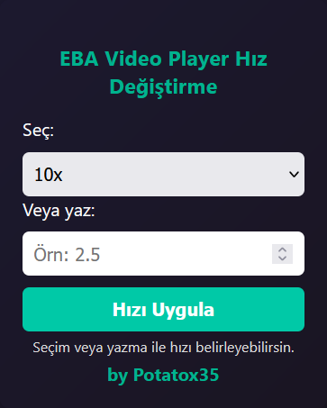

# EBA Playback Speed Controller

EBA platformundaki video playerlarda 2x'den fazla hıza ulaşabilmeyi ve ya istenilen değerde hız değişikliği yapmayı sağlayan mini tarayıcı eklentisidir.

Kullanımı oldukça basittir: İstenilen değerdeki hız seçim kutusundan seçilerek veya değer girilerek uygulanabilir.

## Eklentiden bir görüntü:

